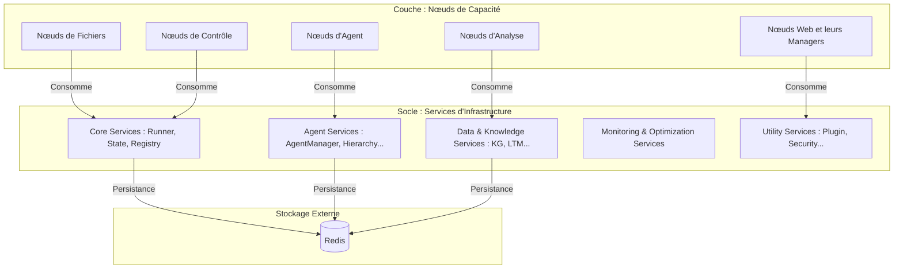

# Architecture Fondamentale : Vue d'Ensemble

L'architecture de Buzzy est conçue autour de deux niveaux de composants : les **Services d'Infrastructure** (le socle technique) et les **Nœuds de Capacité** (la logique métier). Cette séparation permet une grande modularité et une claire distinction des responsabilités.

## Diagramme d'Architecture Conceptuelle

Ce diagramme illustre la relation entre les services d'infrastructure et les nœuds qui les consomment.

## 1. Les Services d'Infrastructure (`src/services`)

Ces services sont les piliers sur lesquels repose tout le système. Ils sont persistants, de bas niveau et fournissent les fonctionnalités transverses essentielles.

### Catégories de Services :

-   **Core (`core/`)**: Le cœur de l'orchestration.
    -   `WorkflowRunner`, `StateManager`, `NodeRegistry`, `CapabilityRegistry`.
-   **Agent (`agent/`)**: Le cycle de vie complet des agents.
    -   `AgentManager`, `AgentHierarchyManager`, `AgentMemoryManager`, `AgentContextManager`.
-   **Données & Connaissances (`data_and_knowledge/`)**: La mémoire et la compréhension du système.
    -   `KnowledgeGraph`, `LongTermMemoryManager`, `SearchIndex`.
-   **Monitoring & Optimisation (`monitoring_and_optimization/`)**: La performance et l'amélioration continue.
    -   `PerformanceMonitor`, `PerformanceOptimizer`, `FeedbackManager`.
-   **Utilitaires (`utilities/`)**: Capacités transverses.
    -   `PluginManager`, `SecurityManager`, `ConversationManager`, `WebCapabilitiesManager`.

## 2. Les Nœuds de Capacité (`src/nodes`)

Les nœuds sont les briques de la logique métier. Ils sont orchestrés par le `WorkflowRunner` et consomment les services d'infrastructure pour accomplir leurs tâches. Certains nœuds complexes, notamment dans le domaine du web, sont eux-mêmes structurés autour de **"Node Managers"**.

### Les "Node Managers"

Un "Node Manager" est un nœud qui agit comme une façade ou un orchestrateur pour un ensemble de capacités métier complexes.

-   **Exemple (`src/nodes/web/navigation/manager`)**: Le `web.navigation.manager` est un nœeud qui, lorsqu'il est exécuté, initialise et coordonne des gestionnaires plus petits et spécialisés (`BrowserManager`, `SessionManager`, `InteractionManager`) pour accomplir sa tâche de navigation web.

Cette approche permet d'encapsuler des logiques très complexes à l'intérieur d'un seul nœud, tout en gardant une organisation interne propre et modulaire. On retrouve ce pattern dans la plupart des capacités web (`auth`, `scraping`, `search`, etc.).

---

**Prochaine lecture :** [01-02-Le_Systeme_de_Noeuds.md](./01-02-Le_Systeme_de_Noeuds.md)