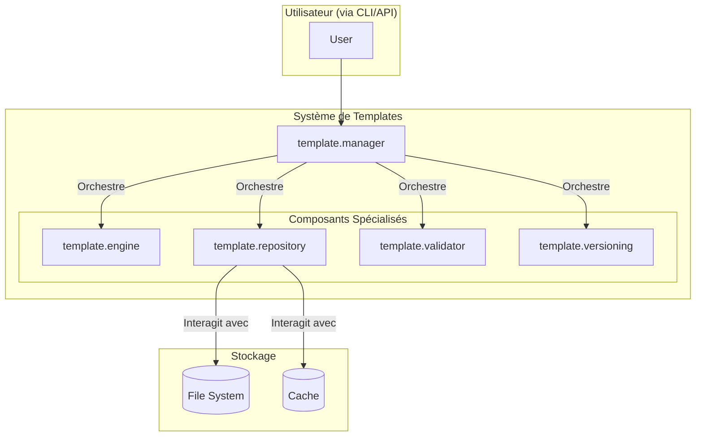

# Le Système de Templates : Architecture et Philosophie

Le concept de **template** est un principe de conception fondamental dans Buzzy, utilisé pour standardiser et réutiliser des configurations à tous les niveaux. Cette section se concentre sur le **système de gestion de templates** formel, qui est l'implémentation la plus aboutie de ce concept.

Ce système est une fonctionnalité puissante conçue pour la réutilisation et la standardisation des Nœuds, des Workflows et des Prompts. Il repose sur une architecture modulaire et robuste, directement implémentée sous forme de nœuds spécialisés dans `src/nodes/template/`.

## Diagramme de l'Architecture

Ce diagramme montre comment le `Template Manager` central orchestre les différents composants du système.

## Les Composants Clés

Le système est conçu comme un ensemble de nœuds qui collaborent, chacun avec une responsabilité unique.

-   **`template.manager`**: C'est le **point d'entrée** et l'orchestrateur principal. Toutes les opérations (création, instanciation, recherche) passent par ce nœud. Il délègue ensuite le travail aux composants spécialisés.

-   **`template.repository`**: Gère le **stockage** persistant des templates. Il est responsable des opérations CRUD (Create, Read, Update, Delete) sur le système de fichiers et de la gestion d'un cache pour des accès rapides.

-   **`template.engine`**: C'est le **moteur d'instanciation**. Son rôle est de prendre un template, de substituer les variables fournies et de générer une instance concrète (un nœud ou un workflow prêt à l'emploi).

-   **`template.validator`**: Le **gardien de la qualité**. Avant qu'un template ne soit sauvegardé, ce nœud le valide par rapport à un schéma JSON pour s'assurer de sa cohérence et de sa conformité.

-   **`template.versioning`**: Gère le **cycle de vie** des templates. Il implémente le versioning sémantique (SemVer), permettant de créer de nouvelles versions, de comparer les changements et de revenir à une version précédente.

Cette architecture modulaire rend le système de templates à la fois puissant, extensible et facile à maintenir.

## L'Interface Web et l'API

Au-delà des nœuds, le système de templates expose ses fonctionnalités via :
-   Une **API** (`src/api/template-api.js`) qui permet une interaction programmatique.
-   Une **Interface Web** (`src/web/template-web.js`) complète qui consomme cette API pour offrir une gestion visuelle des templates (création, édition, validation, instanciation, etc.).

## Le "Template" comme Pattern de Conception

Au-delà de ce système formel, vous rencontrerez le concept de "template" dans de nombreuses autres parties de Buzzy. Il est utilisé comme un pattern pour la configuration et la standardisation :
-   **`AgentFactory`**: Utilise des "templates d'agent" pour standardiser leur création.
-   **`AgentContextManager`**: Utilise des "templates de contexte" pour définir la structure de la mémoire de chaque type d'agent.
-   **Nœuds `web`**: Utilisent des objets de configuration appelés "templates" pour décrire comment interagir avec les différentes plateformes web.

Comprendre le système de templates formel vous donnera donc la clé pour comprendre une grande partie de la philosophie de conception de Buzzy.

---

**Prochaine lecture :** [03-02-Guide_de_creation_de_Templates.md](./03-02-Guide_de_creation_de_Templates.md)